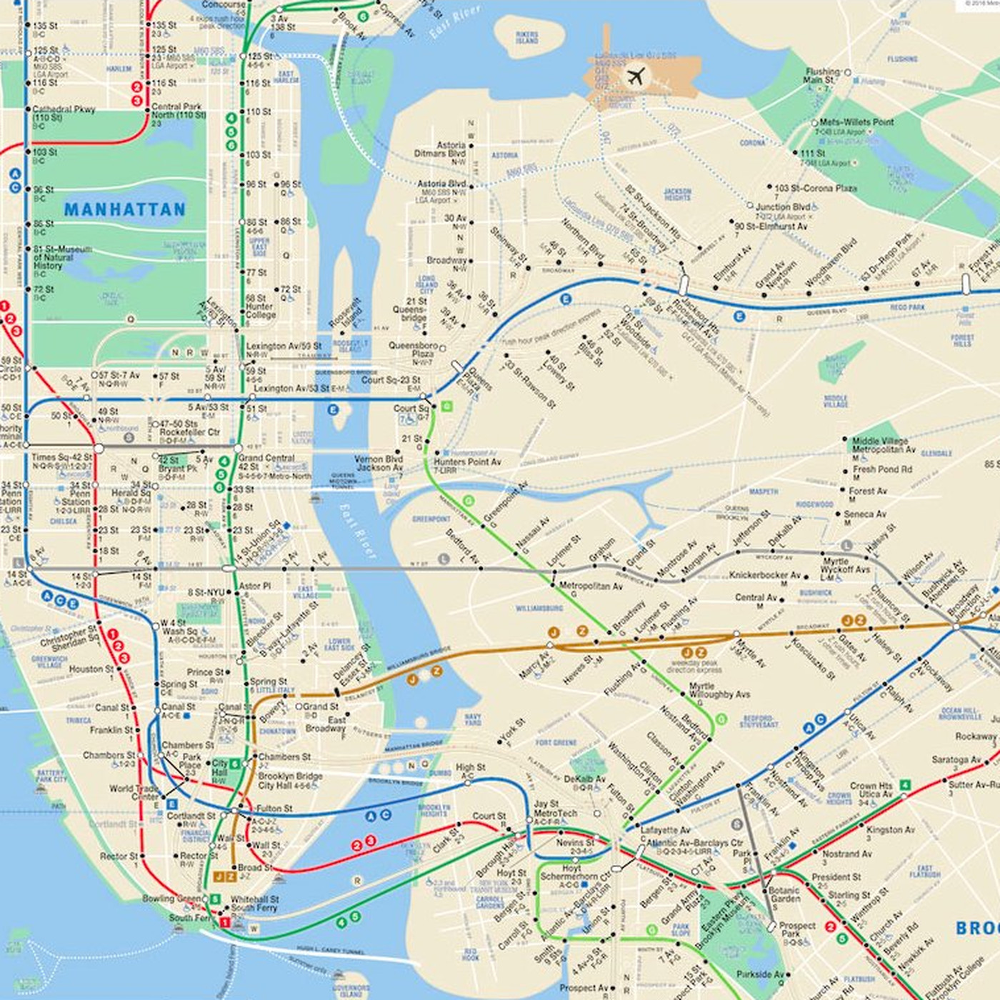

# React Train Router

## Setup
As always,
1. Fork,
1. Clone,
1. Install dependencies,
1. Get hacking!

## Instructions
Currently, every train route in our application is displaying at the same time! Let's leverage React Router to only render the stations we're currently looking for in our nav bar.

1. Before we can implement React Router, we have to install it. Run `npm install react-router-dom` within this folder to install it.
1. After your installation has finished, open `src/index.js`, and import `BrowserRouter` as `Router` from `react-router-dom`.
1. Wrap the `<App />` component in `<Router />`, so we can implement `<Link />`s and `<Route />`s.
1. Open `src/Navbar.jsx`. In the `<nav>`, create a `<Link />` that directs the user to `/union-square`, with the text content `"Union Square-14th St"`, and another that directs the user to `/`, with the text content `"Home"`.
1. In `src/App.js`, add the `<Routes />` component and a new `<Route />` with a path of `/` and make its contents an `<h2>` with the text `"Welcome Home!"`.
1. In `src/App.js`, call the `<Station />` component within a `<Route />`. This `<Route />` should have a `path` that corresponds to the `to` attribute of our newly created `<Link />`.
1. Ensure that the `<Station />` with the trains from Union Square only displays when you click the Union Square link.
1. Once this functionality has been achieved, add corresponding links and routes for the rest of the stations (`/times-square`, `/atlantic-avenue`, and `/fulton-street`).

#### Bonus
1. Add one station to the home page.
1. Look at the documentation for the API and add your own `<Station />` components with different stations and corresponding `<Route />`s.

## Acknowledgments
Thank you to the [MTAPI](https://github.com/jonthornton/MTAPI) for converting the GSFS from the MTA Real-Time API to JSON. 
